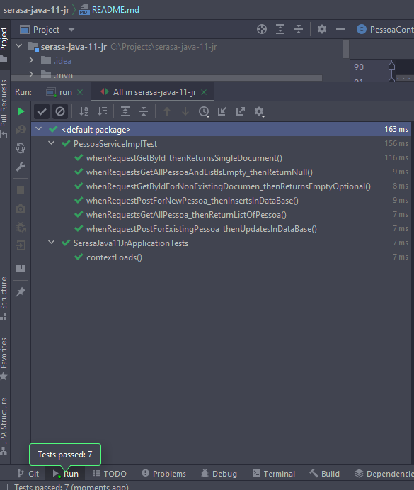
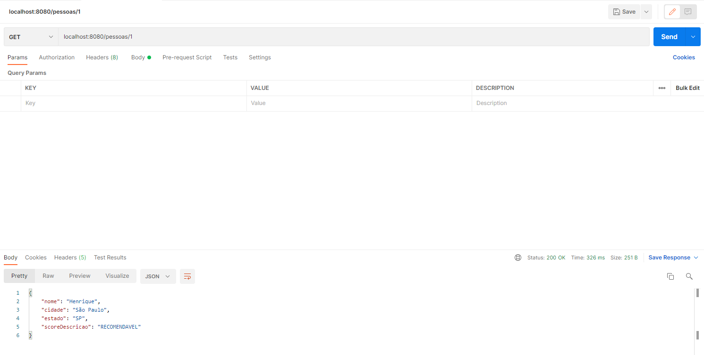
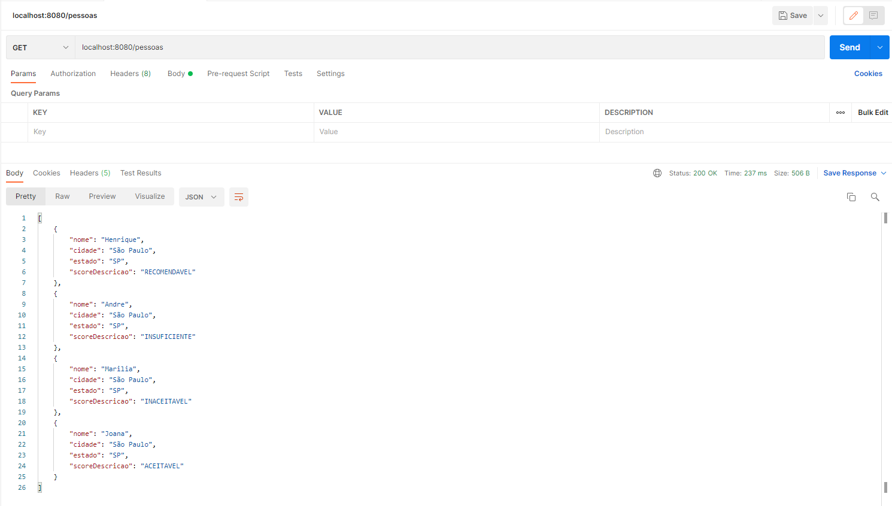
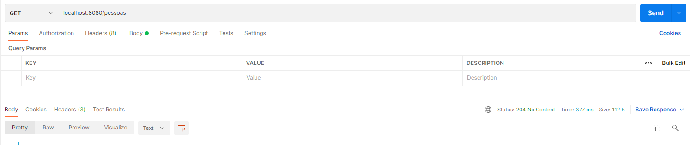
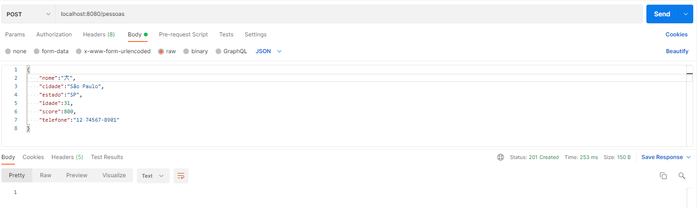
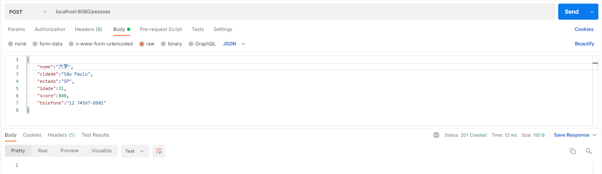
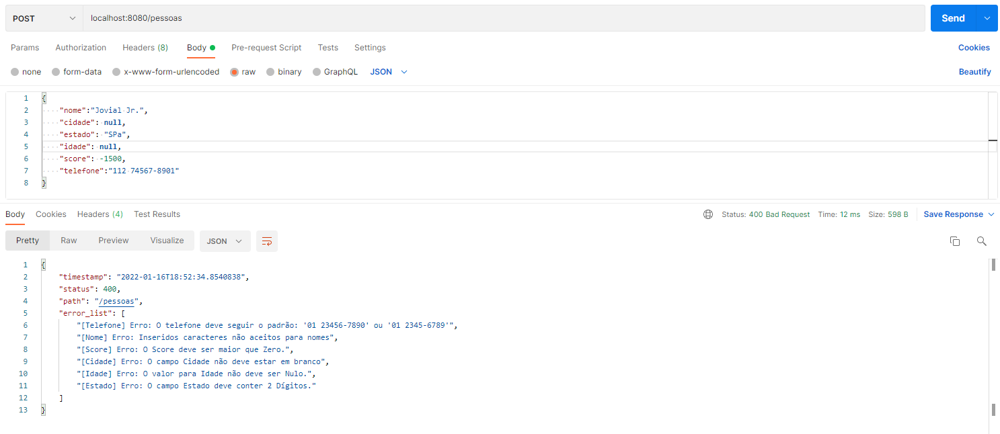

# serasa-java-11-jr
Implementação de API CRUD RESTful para cadastro de pessoa com score

## Requisitos básicos

* linguagem Java (preferência Java 11);
* maven no build do projeto;
* Pode criar archetype usando o start.spring.io (adicione as dependências que achar relevantes);
* Usar framework Spring (incluindo Spring Boot, para iniciar o serviço);
* Montar um banco de dados em memória (pode usar o H2 ou HSQLDB), usando Hibernate na persistência de dados;
* Necessário pelo menos um teste unitário para cada método da camada Service, usando JUnit e Mockito; 

## Requisitos para endpoints

```yaml
Post:
  /pessoa:
    -
        "pessoa": {
          “nome”: “Fulano de Tal”,
          “telefone”: “99 99999-9999”,
          “idade”: 99,
          “cidade”: “Cidade de Fulano”,
          “estado”: “XX”,
          “score”: 1000	// Entre 0 e 1000
        }
    - Adicionar um atributo id automático, além dos dados do POST, durante inclusão dos dados no banco
    - Retornar 201 no sucesso da inclusão;
Get:
  /pessoa/{id}:
    - Se id encontrado no banco, retornar a seguinte estrutura de dados
      "pessoa": {
        “nome”: “Fulano de Tal”,
        “telefone”: “99 99999-9999”,
        “idade”: 99,
        “scoreDescricao”: “Recomendável”
      }
    - Se id encontrado no banco, retornar 200, com a estrutura de dados;
    - Se id não encontrado no banco, retornar 204 (no content);
  /pessoa:
    - Retornar uma lista de todo o cadastro, sendo cada item da lista com a seguinte estrutura de dados
      "pessoas": [
        {
          “nome”: “Fulano de Tal”,
          “cidade”: “Cidade de Fulano”,
          “estado”: “XX”,
          “scoreDescricao”: “Recomendável”
        },
        {
          “nome”: “Sicrano de Tal”,
          “cidade”: “Cidade de Sicrano”,
          “estado”: “YY”,
          “scoreDescricao”: “Insuficiente”
        }
      ]
    - Se algum cadastro encontrado no banco, retornar 200, com a estrutura JSON;
    - Se nenhum item encontrado no banco, retornar 204 (no content);
```

## Lógica do Service

* Montar lógica na camada Service, para retornar o atributo scoreDescricao, correspondente ao score encontrado entre scoreInicial e scoreFinal;

* Usar a seguinte tabela para montagem da lógica de score:

    |scoreDescricao|scoreInicial|scoreFinal|
    |---|---|---|
    |Insuficiente|0|200|
    |Inaceitável|201|500|
    |Aceitável|501|700|
    |Recomendável|701|1000| 

## Estrutura do Banco de dados

```yaml
Pessoa:
  id:
    type: numérico
  nome:
    type: texto
  telefone:
    type: texto
  idade:
    type: numérico
  cidade:
    type: texto
  estado:
    type: texto
  score:
    type: numérico 
```

## Evidências de validação

### 2 Testes realizados em cada método, passando com sucesso:



### Validações em localhost

#### Requisição para id 1 



### Requisição sem id

#### Retornando todos os objetos do banco



#### Retornando HTTP status 204


### Post de cadastro de documento

##### Caso normal



#### Caso com ideograma


#### Caso de formato inválido de dados
